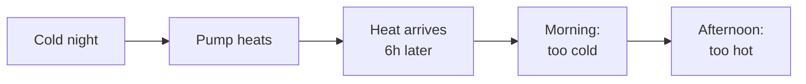
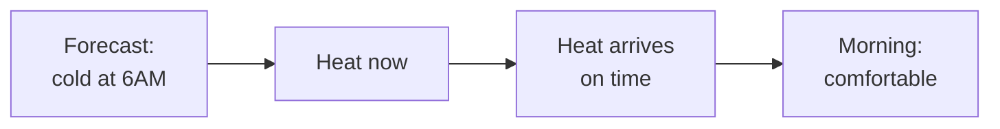
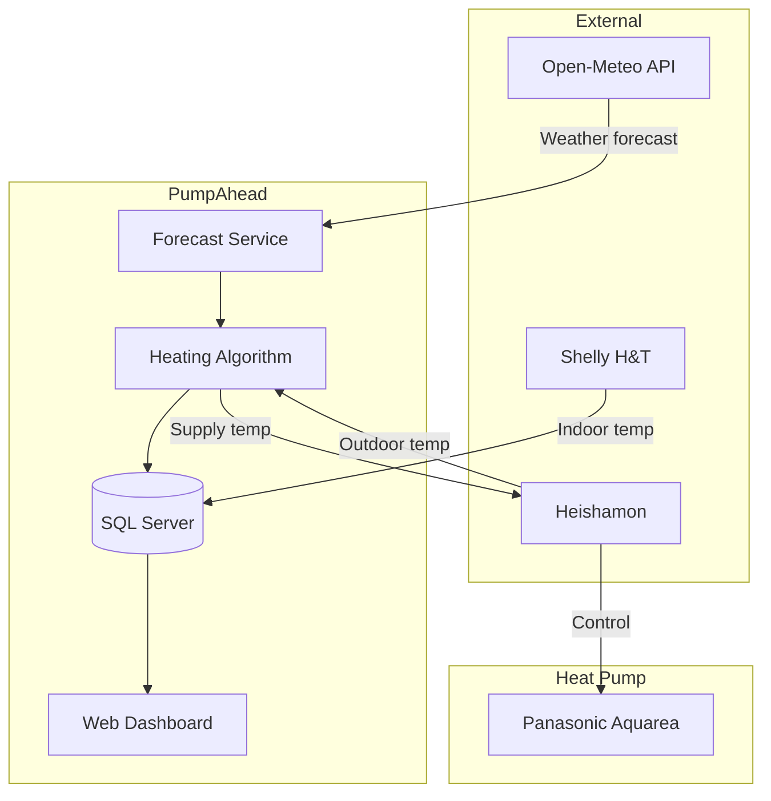
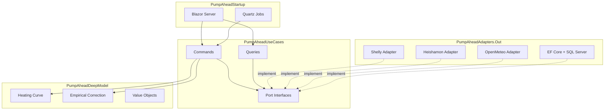

# PumpAhead

**Predictive heating control for Panasonic Aquarea heat pumps**

Stop reacting to weather – start anticipating it.

## The Problem

Traditional heat pump control uses a heating curve based on **current** outdoor temperature. But underfloor heating has 6-12 hours of thermal inertia. This mismatch causes:



**Result:** Temperature swings throughout the day instead of stable comfort.

```mermaid
xychart-beta
    title "Indoor Temperature - Traditional Control"
    x-axis "Time" [00:00, 03:00, 06:00, 09:00, 12:00, 15:00, 18:00, 21:00]
    y-axis "Temperature (°C)" 19 --> 26
    line "Actual" [21.5, 20.8, 20.2, 20.5, 22.0, 24.2, 24.8, 23.5]
    line "Target" [22, 22, 22, 22, 22, 22, 22, 22]
```

## The Solution

PumpAhead looks at the forecasted temperature **X hours ahead** (where X = your system's thermal lag) and adjusts heating proactively.



**Result:** Stable temperature with reduced energy waste.

```mermaid
xychart-beta
    title "Indoor Temperature - PumpAhead Control"
    x-axis "Time" [00:00, 03:00, 06:00, 09:00, 12:00, 15:00, 18:00, 21:00]
    y-axis "Temperature (°C)" 19 --> 26
    line "Actual" [22.2, 22.0, 21.8, 22.0, 22.3, 22.5, 22.3, 22.1]
    line "Target" [22, 22, 22, 22, 22, 22, 22, 22]
```

## How It Works



### Algorithm

1. Fetch weather forecast for the next 24 hours
2. Look at temperature **OFFSET hours ahead** (e.g., 6h for underfloor heating)
3. Apply empirical correction (learns from past forecast errors)
4. Calculate supply water temperature using heating curve
5. Send command to heat pump via Heishamon

### Safety Limits

| Parameter | Value | Purpose |
|-----------|-------|---------|
| Min supply temp | 20°C | Below this, heating is ineffective |
| Max supply temp | 35°C | Protects floor screed from cracking |

## Requirements

### Hardware

| Component | Purpose | Cost |
|-----------|---------|------|
| Panasonic Aquarea | Heat pump (any Heishamon-compatible model) | - |
| Heishamon | Communication module for heat pump | ~€45 |
| Shelly H&T Gen3 | Indoor temperature sensor | ~€25 |
| Server | Runs PumpAhead (RPi, NAS, or PC) | - |

### System Compatibility

**Works with:**
- Underfloor heating
- Heat buffer tanks
- Heavy construction buildings (thermal mass)

**Not suitable for:**
- Radiators (fast response, low inertia)
- Other heat pump brands (Heishamon is Panasonic-only)

## Architecture



Hexagonal architecture makes it easy to add support for other devices or services.

## Configuration

| Parameter | Description | Where |
|-----------|-------------|-------|
| Device addresses | Shelly IP, Heishamon hostname | appsettings.json |
| Polling intervals | How often to read sensors / run algorithm | appsettings.json |
| Offset | Thermal lag in hours | UI |
| Heating curve | Temperature mapping points | UI |
| Location | Lat/Lon for weather forecast | UI |

## Expected Results

| Metric | Before | After |
|--------|--------|-------|
| Temperature swings | ~4°C | ~1°C |
| Morning comfort | Cold | Stable |
| Energy usage | Baseline | -10-15% |

Energy savings come from heating during warmer parts of the day (better COP).

## Documentation

- [HLD](docs/pump-ahead-hld.md) – High-level design, algorithm details
- [Code Guide](docs/code-guide.md) – Implementation guidelines

## Tech Stack

| Layer | Technology |
|-------|------------|
| Framework | .NET 10 |
| Frontend | Blazor Server |
| Database | SQL Server + EF Core |
| Scheduler | Quartz.NET |
| Logging | Serilog |

## License

MIT
